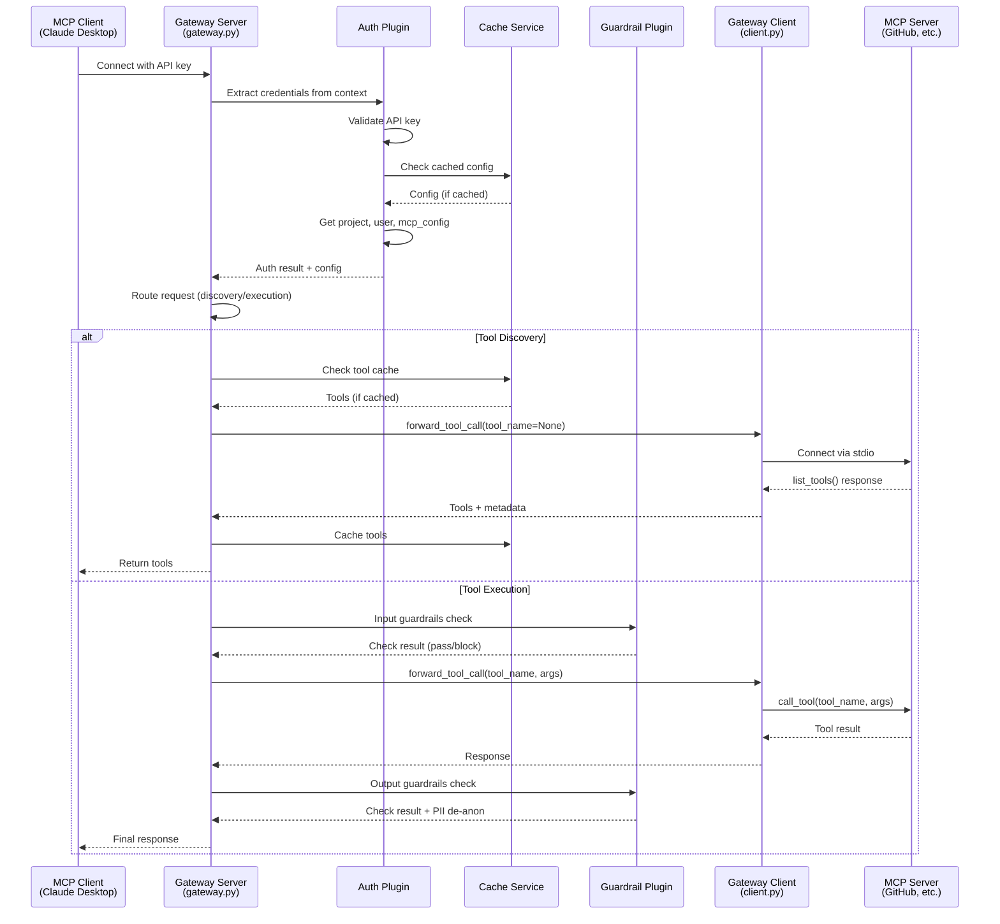
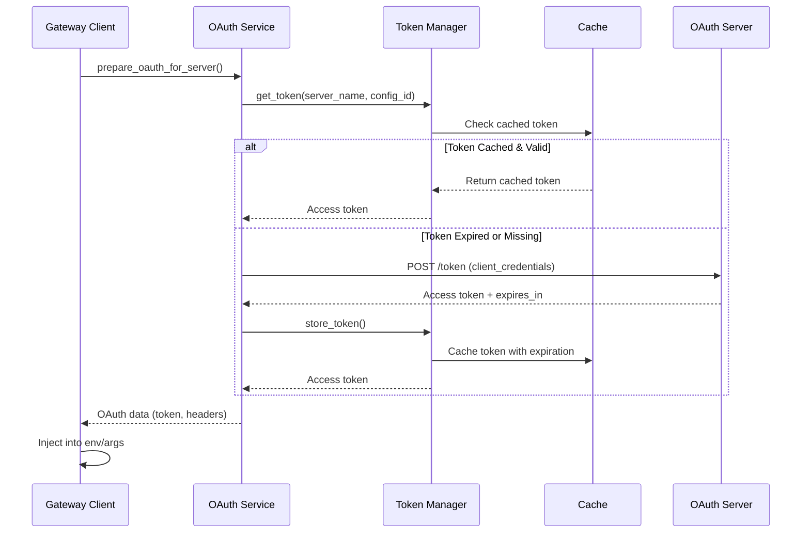

## Request Flow Overview

The Secure MCP Gateway processes requests through a multi-stage pipeline that ensures security, performance, and observability at every step.

## Complete Request Flow



## Detailed Step-by-Step Process

### Step 1: Client Connection

**Location:** Client configuration (Claude Desktop, Cursor)

The MCP client connects to the gateway with credentials in the request context:

**stdio mode:**
```json
{
  "mcpServers": {
    "Enkrypt Secure MCP Gateway": {
      "command": "mcp",
      "args": ["run", "/path/to/gateway.py"],
      "env": {
        "ENKRYPT_GATEWAY_KEY": "your-api-key-here",
        "ENKRYPT_PROJECT_ID": "project-uuid",
        "ENKRYPT_USER_ID": "user-uuid"
      }
    }
  }
}
```

**HTTP mode:**
```bash
curl -X POST http://gateway:8000/mcp/ \
  -H "Authorization: Bearer YOUR_API_KEY" \
  -d '{"method": "tools/list"}'
```

### Step 2: Gateway Server Receives Request

**Location:** `src/secure_mcp_gateway/gateway.py:796`

The FastMCP server receives the request and extracts credentials:

```python
# Gateway running on 0.0.0.0:8000/mcp/
mcp = FastMCP(
    name="Enkrypt Secure MCP Gateway",
    host="0.0.0.0",
    port=8000,
    streamable_http_path="/mcp/"
)

# Request handler extracts credentials
credentials = get_gateway_credentials(ctx)
# Returns: {gateway_key, project_id, user_id}
```

### Step 3: Authentication

**Location:** `src/secure_mcp_gateway/plugins/auth/config_manager.py`

The auth manager validates the API key and retrieves the user context:

```python
auth_manager = get_auth_config_manager()
auth_result = await auth_manager.authenticate(ctx)

# Auth result contains:
# - authenticated: bool
# - project_id: str
# - user_id: str
# - mcp_config_id: str
# - gateway_config: dict
```

**Validation process:**

1. Extract `gateway_key` from request context
2. Look up API key in `apikeys` section of config
3. Retrieve associated `project_id` and `user_id`
4. Get `mcp_config_id` from project configuration
5. Load full gateway configuration

**Cache check:** `src/secure_mcp_gateway/client.py:632`

```python
# Check if config is cached
cached_config = get_cached_gateway_config(cache_client, config_id)

if cached_config:
    logger.debug("Using cached gateway config")
    return cached_config

# Otherwise, load from file and cache
config = load_config_from_file()
cache_gateway_config(cache_client, config_id, config)
```

### Step 4: Request Routing

**Location:** `src/secure_mcp_gateway/gateway.py`

The gateway routes the request to the appropriate service:

#### Route 1: Tool Discovery

**Triggered by:** `enkrypt_discover_all_tools` or `enkrypt_list_all_servers`

**Location:** `src/secure_mcp_gateway/services/discovery/discovery_service.py`

```python
class DiscoveryService:
    async def discover_tools(self, ctx, server_name, ...):
        # 1. Check tool cache first
        cached_tools = get_cached_tools(cache_client, session_key, server_name)
        if cached_tools:
            return {"status": "success", "tools": cached_tools, "source": "cache"}
        
        # 2. Check if tools are explicitly configured
        server_config = get_server_config(server_name)
        if server_config.get("tools"):
            return {"status": "success", "tools": server_config["tools"], "source": "config"}
        
        # 3. Discover tools from server
        result = await forward_tool_call(
            server_name=server_name,
            tool_name=None,  # None triggers discovery
            gateway_config=gateway_config
        )
        
        # 4. Cache discovered tools
        cache_tools(cache_client, session_key, server_name, result["tools"])
        
        return {"status": "success", "tools": result["tools"], "source": "discovery"}
```

#### Route 2: Tool Execution

**Triggered by:** `enkrypt_secure_call_tools`

**Location:** `src/secure_mcp_gateway/services/execution/secure_tool_execution_service.py`

```python
class SecureToolExecutionService:
    async def execute_secure_tools(self, ctx, server_name, tool_calls, logger):
        # 1. Authenticate and get config
        auth_result = await enkrypt_authenticate(ctx)
        gateway_config = auth_result["gateway_config"]
        
        results = []
        for tool_call in tool_calls:
            # 2a. Run input guardrails (if enabled)
            if input_guardrails_enabled:
                guardrail_result = await check_input_guardrails(
                    request=tool_call["args"],
                    policy=input_guardrails_policy
                )
                if guardrail_result["blocked"]:
                    results.append({"error": "Blocked by input guardrails"})
                    continue
            
            # 2b. Execute tool
            response = await forward_tool_call(
                server_name=server_name,
                tool_name=tool_call["name"],
                args=tool_call["args"],
                gateway_config=gateway_config
            )
            
            # 2c. Run output guardrails (if enabled)
            if output_guardrails_enabled:
                guardrail_result = await check_output_guardrails(
                    request=tool_call["args"],
                    response=response,
                    policy=output_guardrails_policy
                )
                if guardrail_result["blocked"]:
                    results.append({"error": "Blocked by output guardrails"})
                    continue
                
                # De-anonymize PII if it was redacted
                response = deanonymize_pii(response, guardrail_result)
            
            results.append(response)
        
        return {"status": "success", "results": results}
```

### Step 5: Gateway Client Forwards Request

**Location:** `src/secure_mcp_gateway/client.py:294`

The gateway client connects to the actual MCP server via stdio:

```python
async def forward_tool_call(server_name, tool_name, args=None, gateway_config=None):
    # Get server configuration
    server_entry = get_server_entry(server_name, gateway_config)
    config = server_entry["config"]
    command = config["command"]
    command_args = config["args"]
    env = config.get("env", None)
    
    # Prepare OAuth if configured
    oauth_data, oauth_error = await prepare_oauth_for_server(
        server_name=server_name,
        server_entry=server_entry,
        config_id=mcp_config_id,
        project_id=project_id
    )
    
    if oauth_data:
        # Inject OAuth credentials
        env = inject_oauth_into_env(env, oauth_data)
        command_args = inject_oauth_into_args(command_args, oauth_data)
    
    # Connect to server via stdio
    async with stdio_client(
        StdioServerParameters(command=command, args=command_args, env=env)
    ) as (read, write):
        async with ClientSession(read, write) as session:
            # Initialize connection
            init_result = await session.initialize()
            
            # Extract server metadata
            server_info = init_result.serverInfo
            
            if tool_name is None:
                # Tool discovery
                tools_result = await session.list_tools()
                return {
                    "tools": tools_result,
                    "server_metadata": {
                        "description": server_info.description,
                        "name": server_info.name,
                        "version": server_info.version
                    }
                }
            else:
                # Tool execution
                return await session.call_tool(tool_name, arguments=args)
```

### Step 6: MCP Server Processes Request

The actual MCP server (e.g., GitHub, filesystem, custom server) receives and processes the request:

```python
# Example: GitHub MCP Server
@server.tool()
async def search_repositories(query: str, max_results: int = 10):
    """Search GitHub repositories."""
    results = await github_api.search_repos(query, limit=max_results)
    return {"repositories": results}
```

### Step 7: Response Processing

The response flows back through the gateway:

#### 7a. Tool Discovery Response

**Location:** `src/secure_mcp_gateway/services/discovery/discovery_service.py`

```python
# Cache discovered tools
tools = response["tools"]
cache_tools(cache_client, session_key, server_name, tools)

# Return with metadata
return {
    "status": "success",
    "message": f"Discovered {len(tools)} tools",
    "tools": tools,
    "source": "discovery",
    "server_metadata": response["server_metadata"]
}
```

**Cache storage:** `src/secure_mcp_gateway/client.py:515`

```python
def cache_tools(cache_client, id, server_name, tools):
    expires_in_seconds = int(ENKRYPT_TOOL_CACHE_EXPIRATION * 3600)  # 4 hours
    key = get_server_hashed_key(id, server_name)  # MD5 hash
    
    # Serialize tools to JSON
    serializable_tools = {
        "tools": [
            {
                "name": tool.name,
                "description": tool.description,
                "inputSchema": tool.inputSchema
            }
            for tool in tools
        ]
    }
    
    # Store in cache with expiration
    cache_client.setex(key, expires_in_seconds, json.dumps(serializable_tools))
    
    # Maintain server registry
    registry_key = get_gateway_servers_registry_hashed_key(id)
    cache_client.sadd(registry_key, server_name)
```

#### 7b. Tool Execution Response

**Output guardrails processing:**

```python
if output_guardrails_policy.get("enabled"):
    guardrail_result = await guardrail_provider.check_output(
        request=original_request,
        response=tool_response,
        policy=output_guardrails_policy
    )
    
    # Check for blocking conditions
    if guardrail_result.get("blocked"):
        return {
            "status": "error",
            "message": "Response blocked by output guardrails",
            "details": guardrail_result["violations"]
        }
    
    # Check relevancy (if enabled)
    if policy["additional_config"].get("relevancy"):
        relevancy_score = guardrail_result.get("relevancy_score", 1.0)
        if relevancy_score < RELEVANCY_THRESHOLD:  # 0.75
            return {"error": "Response not relevant to request"}
    
    # Check adherence (if enabled)
    if policy["additional_config"].get("adherence"):
        adherence_score = guardrail_result.get("adherence_score", 1.0)
        if adherence_score < ADHERENCE_THRESHOLD:  # 0.75
            return {"error": "Response does not adhere to instructions"}
    
    # De-anonymize PII
    if guardrail_result.get("pii_mapping"):
        tool_response = deanonymize_pii(tool_response, guardrail_result["pii_mapping"])
```

### Step 8: Telemetry and Logging

**Location:** Throughout the request flow

All operations are logged with structured context:

```python
# Build context for logging
extra = build_log_extra(
    ctx=ctx,
    custom_id=generate_custom_id(),
    server_name=server_name,
    tool_name=tool_name,
    project_id=project_id,
    user_id=user_id
)

# Log with context
logger.info("Tool execution started", extra=extra)

# Trace with span
with tracer.start_as_current_span("tool_execution") as span:
    span.set_attribute("server_name", server_name)
    span.set_attribute("tool_name", tool_name)
    span.set_attribute("project_id", project_id)
    
    # Execute operation
    result = await execute_tool(...)
    
    span.set_attribute("success", True)
    span.set_attribute("latency_ms", latency)
```

### Step 9: Response Return to Client

The final response is returned to the MCP client:

```json
{
  "status": "success",
  "results": [
    {
      "tool": "search_repositories",
      "result": {
        "repositories": [
          {"name": "example-repo", "stars": 1234}
        ]
      }
    }
  ],
  "metadata": {
    "server_name": "github_server",
    "execution_time_ms": 245,
    "guardrails_applied": true
  }
}
```

## OAuth Token Flow

For servers requiring OAuth authentication:

**Location:** `src/secure_mcp_gateway/services/oauth/`



**Token acquisition:** `src/secure_mcp_gateway/services/oauth/oauth_service.py:71`

```python
async def get_access_token(
    self, server_name, oauth_config, config_id, project_id, force_refresh=False
):
    # Check cache unless force refresh
    if not force_refresh:
        cached_token = await self.token_manager.get_token(
            server_name, oauth_config, config_id, project_id
        )
        if cached_token:
            return cached_token.access_token, None
    
    # Obtain new token with retry logic
    token = await self._client_credentials_flow_with_retry(
        server_name, oauth_config
    )
    
    # Store in cache
    await self.token_manager.store_token(
        server_name, token, config_id, project_id
    )
    
    return token.access_token, None
```

## Cache Strategy

### Cache Levels

1. **Local in-memory cache** (single instance)
2. **External cache** (Redis/KeyDB for multi-instance)

### Cache Keys

All keys are MD5 hashed for security:

```python
def hash_key(key):
    return hashlib.md5(key.encode()).hexdigest()

# Examples:
server_tools_key = hash_key(f"{config_id}-{server_name}-tools")
gateway_config_key = hash_key(f"{config_id}-mcp-config")
api_key_mapping = hash_key(f"gateway_key-{api_key}")
```

### Cache Expiration

- **Tool cache:** 4 hours (default)
- **Gateway config cache:** 24 hours (default)
- **OAuth tokens:** Based on `expires_in` from OAuth server (with 5 min buffer)

### Cache Registry

The gateway maintains registries for cleanup:

```python
# Server registry per config
registry_key = hash_key(f"registry:{config_id}:servers")
cache_client.sadd(registry_key, server_name)

# Global config registry
gateway_registry = hash_key("registry:gateway/user")
cache_client.sadd(gateway_registry, config_id)
```

## Error Handling

Errors are handled at each stage with detailed context:

**Location:** `src/secure_mcp_gateway/error_handling.py`

```python
try:
    result = await execute_operation()
except AuthenticationError as e:
    return {
        "status": "error",
        "error_code": "AUTH_FAILED",
        "message": "Authentication failed",
        "details": str(e)
    }
except GuardrailViolation as e:
    return {
        "status": "blocked",
        "error_code": "GUARDRAIL_VIOLATION",
        "message": "Request blocked by guardrails",
        "violations": e.violations
    }
except TimeoutError as e:
    return {
        "status": "error",
        "error_code": "TIMEOUT",
        "message": f"Operation timed out after {e.timeout}s"
    }
```

## Next Steps

<CardGroup cols={2}>
  <Card title="Configuration" icon="sliders" href="/concepts/configuration">
    Learn about all configuration options and settings
  </Card>
  <Card title="Authentication" icon="lock" href="/concepts/authentication">
    Understand authentication mechanisms and API keys
  </Card>
  <Card title="Guardrails" icon="shield" href="/features/guardrails">
    Explore input and output protection features
  </Card>
  <Card title="Caching" icon="database" href="/features/caching">
    Optimize performance with intelligent caching
  </Card>
</CardGroup>