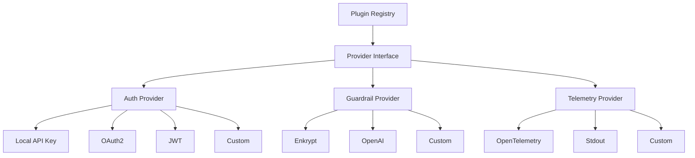

## Overview

Secure MCP Gateway uses a plugin architecture that allows you to extend core functionality with custom implementations. Create your own authentication providers, guardrail detectors, or telemetry exporters without modifying the gateway core.

## Plugin Types

<CardGroup cols={3}>
  <Card title="Auth Plugins" icon="key">
    Custom authentication methods (JWT, LDAP, SSO, custom API keys)
  </Card>
  
  <Card title="Guardrail Plugins" icon="shield-check">
    Custom content filters and validators (OpenAI, AWS, custom rules)
  </Card>
  
  <Card title="Telemetry Plugins" icon="chart-line">
    Custom logging and metrics exporters (Datadog, New Relic, stdout)
  </Card>
</CardGroup>

## Architecture

The gateway uses a **provider-based plugin system** following SOLID principles:



## Creating an Auth Plugin

### Auth Provider Interface

All auth providers must implement the `AuthProvider` abstract base class:

```python src/secure_mcp_gateway/plugins/auth/my_provider.py
from typing import Dict, Any, List
from secure_mcp_gateway.plugins.auth.base import (
    AuthProvider,
    AuthCredentials,
    AuthResult,
    AuthStatus,
    AuthMethod,
)

class MyAuthProvider(AuthProvider):
    """Custom authentication provider."""
    
    def __init__(self, config: Dict[str, Any]):
        """Initialize with configuration."""
        self.config = config
        self.api_endpoint = config.get("api_endpoint")
        self.timeout = config.get("timeout", 30)
    
    def get_name(self) -> str:
        """Unique provider name."""
        return "my_auth"
    
    def get_version(self) -> str:
        """Provider version."""
        return "1.0.0"
    
    def get_supported_methods(self) -> List[AuthMethod]:
        """Supported authentication methods."""
        return [AuthMethod.API_KEY, AuthMethod.BEARER_TOKEN]
    
    async def authenticate(self, credentials: AuthCredentials) -> AuthResult:
        """
        Authenticate user with provided credentials.
        
        Args:
            credentials: Contains api_key, gateway_key, headers, etc.
        
        Returns:
            AuthResult with authentication status and user info
        """
        api_key = credentials.api_key or credentials.gateway_key
        
        if not api_key:
            return AuthResult(
                status=AuthStatus.INVALID_CREDENTIALS,
                authenticated=False,
                message="API key required",
                error="Missing API key"
            )
        
        # Custom authentication logic
        # Example: Call external API
        try:
            user_data = await self._validate_with_api(api_key)
            
            return AuthResult(
                status=AuthStatus.SUCCESS,
                authenticated=True,
                message="Authentication successful",
                user_id=user_data["user_id"],
                project_id=user_data["project_id"],
                gateway_config=user_data["config"],
                permissions=user_data.get("permissions", []),
                roles=user_data.get("roles", [])
            )
        except Exception as e:
            return AuthResult(
                status=AuthStatus.ERROR,
                authenticated=False,
                message="Authentication failed",
                error=str(e)
            )
    
    async def validate_session(self, session_id: str) -> bool:
        """Validate if session is still valid."""
        # Implement session validation
        return True
    
    async def refresh_authentication(
        self, session_id: str, credentials: AuthCredentials
    ) -> AuthResult:
        """Refresh authentication for existing session."""
        # Implement token refresh logic
        return await self.authenticate(credentials)
    
    def validate_config(self, config: Dict[str, Any]) -> bool:
        """Validate provider configuration."""
        required = ["api_endpoint"]
        return all(key in config for key in required)
    
    def get_required_config_keys(self) -> List[str]:
        """Required configuration keys."""
        return ["api_endpoint"]
    
    async def _validate_with_api(self, api_key: str) -> Dict[str, Any]:
        """Validate API key with external service."""
        import httpx
        
        async with httpx.AsyncClient(timeout=self.timeout) as client:
            response = await client.post(
                f"{self.api_endpoint}/auth/validate",
                headers={"Authorization": f"Bearer {api_key}"},
            )
            response.raise_for_status()
            return response.json()
```

### Register the Provider

Update your config to use the custom provider:

```json ~/.enkrypt/enkrypt_mcp_config.json
{
  "plugins": {
    "auth": {
      "provider": "my_auth",
      "config": {
        "api_endpoint": "https://auth.mycompany.com",
        "timeout": 10
      }
    }
  }
}
```

### Example: JWT Auth Provider

<CodeGroup>
```python jwt_provider.py
import jwt
from datetime import datetime
from typing import Dict, Any, List
from secure_mcp_gateway.plugins.auth.base import (
    AuthProvider,
    AuthCredentials,
    AuthResult,
    AuthStatus,
    AuthMethod,
)

class JWTAuthProvider(AuthProvider):
    """JWT-based authentication."""
    
    def __init__(self, secret_key: str, algorithm: str = "HS256"):
        self.secret_key = secret_key
        self.algorithm = algorithm
    
    def get_name(self) -> str:
        return "jwt"
    
    def get_version(self) -> str:
        return "1.0.0"
    
    def get_supported_methods(self) -> List[AuthMethod]:
        return [AuthMethod.JWT, AuthMethod.BEARER_TOKEN]
    
    async def authenticate(self, credentials: AuthCredentials) -> AuthResult:
        """Validate JWT token."""
        token = credentials.access_token or credentials.headers.get("Authorization", "").replace("Bearer ", "")
        
        if not token:
            return AuthResult(
                status=AuthStatus.INVALID_CREDENTIALS,
                authenticated=False,
                message="JWT token required"
            )
        
        try:
            # Decode and validate JWT
            payload = jwt.decode(
                token,
                self.secret_key,
                algorithms=[self.algorithm]
            )
            
            # Check expiration
            if datetime.fromtimestamp(payload["exp"]) < datetime.now():
                return AuthResult(
                    status=AuthStatus.EXPIRED,
                    authenticated=False,
                    message="Token expired"
                )
            
            return AuthResult(
                status=AuthStatus.SUCCESS,
                authenticated=True,
                message="JWT valid",
                user_id=payload["user_id"],
                project_id=payload.get("project_id"),
                permissions=payload.get("permissions", []),
                metadata={"jwt_payload": payload}
            )
        
        except jwt.InvalidTokenError as e:
            return AuthResult(
                status=AuthStatus.INVALID_CREDENTIALS,
                authenticated=False,
                message="Invalid JWT",
                error=str(e)
            )
    
    async def validate_session(self, session_id: str) -> bool:
        # JWT is stateless, no session validation needed
        return True
    
    async def refresh_authentication(
        self, session_id: str, credentials: AuthCredentials
    ) -> AuthResult:
        # Re-authenticate with refresh token
        return await self.authenticate(credentials)
```

```json Configuration
{
  "plugins": {
    "auth": {
      "provider": "jwt",
      "config": {
        "secret_key": "your-secret-key-here",
        "algorithm": "HS256"
      }
    }
  }
}
```
</CodeGroup>

## Creating a Guardrail Plugin

### Guardrail Provider Interface

```python src/secure_mcp_gateway/plugins/guardrails/my_guardrail.py
from typing import Dict, Any, List, Optional
from secure_mcp_gateway.plugins.guardrails.base import (
    GuardrailProvider,
    GuardrailRequest,
    GuardrailResponse,
    GuardrailViolation,
    GuardrailAction,
    ViolationType,
    InputGuardrail,
    OutputGuardrail,
)

class MyInputGuardrail:
    """Custom input guardrail implementation."""
    
    def __init__(self, config: Dict[str, Any]):
        self.config = config
        self.blocked_keywords = config.get("blocked_keywords", [])
        self.severity_threshold = config.get("severity_threshold", 0.7)
    
    async def validate(self, request: GuardrailRequest) -> GuardrailResponse:
        """Validate input content."""
        violations = []
        content = request.content.lower()
        
        # Check for blocked keywords
        for keyword in self.blocked_keywords:
            if keyword.lower() in content:
                violations.append(
                    GuardrailViolation(
                        violation_type=ViolationType.KEYWORD_VIOLATION,
                        severity=1.0,
                        message=f"Blocked keyword detected: {keyword}",
                        action=GuardrailAction.BLOCK,
                        metadata={"keyword": keyword}
                    )
                )
        
        # Custom detection logic
        if self._detect_sensitive_pattern(content):
            violations.append(
                GuardrailViolation(
                    violation_type=ViolationType.CUSTOM,
                    severity=0.9,
                    message="Sensitive pattern detected",
                    action=GuardrailAction.BLOCK,
                    metadata={"pattern": "sensitive_data"}
                )
            )
        
        is_safe = len(violations) == 0
        action = GuardrailAction.ALLOW if is_safe else GuardrailAction.BLOCK
        
        return GuardrailResponse(
            is_safe=is_safe,
            action=action,
            violations=violations,
            metadata={"provider": "my_guardrail"}
        )
    
    def get_supported_detectors(self) -> List[ViolationType]:
        return [
            ViolationType.KEYWORD_VIOLATION,
            ViolationType.CUSTOM,
        ]
    
    def _detect_sensitive_pattern(self, content: str) -> bool:
        """Custom pattern detection."""
        # Example: Detect credit card numbers
        import re
        pattern = r"\b\d{4}[\s-]?\d{4}[\s-]?\d{4}[\s-]?\d{4}\b"
        return bool(re.search(pattern, content))


class MyGuardrailProvider(GuardrailProvider):
    """Custom guardrail provider."""
    
    def __init__(self, blocked_keywords: List[str] = None):
        self.blocked_keywords = blocked_keywords or []
    
    def get_name(self) -> str:
        return "my_guardrail"
    
    def get_version(self) -> str:
        return "1.0.0"
    
    def create_input_guardrail(self, config: Dict[str, Any]) -> Optional[InputGuardrail]:
        """Create input guardrail instance."""
        return MyInputGuardrail({
            **config,
            "blocked_keywords": self.blocked_keywords
        })
    
    def create_output_guardrail(self, config: Dict[str, Any]) -> Optional[OutputGuardrail]:
        """Create output guardrail instance."""
        # Can reuse the same guardrail or create a different one
        return MyInputGuardrail({
            **config,
            "blocked_keywords": self.blocked_keywords
        })
    
    def validate_config(self, config: Dict[str, Any]) -> bool:
        return True
    
    def get_required_config_keys(self) -> List[str]:
        return []
```

### Register Guardrail Provider

```json ~/.enkrypt/enkrypt_mcp_config.json
{
  "plugins": {
    "guardrails": {
      "provider": "my_guardrail",
      "config": {
        "blocked_keywords": ["password", "secret", "confidential"],
        "severity_threshold": 0.8
      }
    }
  }
}
```

### Example: OpenAI Moderation Provider

<CodeGroup>
```python openai_provider.py
import httpx
from typing import Dict, Any, List, Optional
from secure_mcp_gateway.plugins.guardrails.base import (
    GuardrailProvider,
    GuardrailRequest,
    GuardrailResponse,
    GuardrailViolation,
    GuardrailAction,
    ViolationType,
    InputGuardrail,
)

class OpenAIInputGuardrail:
    """OpenAI Moderation API guardrail."""
    
    def __init__(self, api_key: str, threshold: float = 0.7):
        self.api_key = api_key
        self.threshold = threshold
    
    async def validate(self, request: GuardrailRequest) -> GuardrailResponse:
        """Validate using OpenAI Moderation API."""
        async with httpx.AsyncClient() as client:
            response = await client.post(
                "https://api.openai.com/v1/moderations",
                headers={"Authorization": f"Bearer {self.api_key}"},
                json={"input": request.content},
            )
            
            result = response.json()["results"][0]
            violations = []
            is_safe = True
            
            # Check flagged categories
            categories = result.get("categories", {})
            scores = result.get("category_scores", {})
            
            for category, flagged in categories.items():
                if flagged and scores.get(category, 0) >= self.threshold:
                    is_safe = False
                    violations.append(
                        GuardrailViolation(
                            violation_type=self._map_category(category),
                            severity=scores[category],
                            message=f"Content flagged for {category}",
                            action=GuardrailAction.BLOCK,
                            metadata={"category": category, "score": scores[category]}
                        )
                    )
            
            return GuardrailResponse(
                is_safe=is_safe,
                action=GuardrailAction.ALLOW if is_safe else GuardrailAction.BLOCK,
                violations=violations,
                metadata={"provider": "openai-moderation"}
            )
    
    def get_supported_detectors(self) -> List[ViolationType]:
        return [
            ViolationType.TOXIC_CONTENT,
            ViolationType.NSFW_CONTENT,
        ]
    
    def _map_category(self, category: str) -> ViolationType:
        mapping = {
            "hate": ViolationType.TOXIC_CONTENT,
            "violence": ViolationType.TOXIC_CONTENT,
            "sexual": ViolationType.NSFW_CONTENT,
            "self-harm": ViolationType.TOXIC_CONTENT,
        }
        return mapping.get(category, ViolationType.CUSTOM)


class OpenAIGuardrailProvider(GuardrailProvider):
    def __init__(self, api_key: str):
        self.api_key = api_key
    
    def get_name(self) -> str:
        return "openai_moderation"
    
    def get_version(self) -> str:
        return "1.0.0"
    
    def create_input_guardrail(self, config: Dict[str, Any]) -> Optional[InputGuardrail]:
        return OpenAIInputGuardrail(
            api_key=self.api_key,
            threshold=config.get("threshold", 0.7)
        )
    
    def create_output_guardrail(self, config: Dict[str, Any]) -> Optional[InputGuardrail]:
        return OpenAIInputGuardrail(
            api_key=self.api_key,
            threshold=config.get("threshold", 0.7)
        )
```

```json Configuration
{
  "plugins": {
    "guardrails": {
      "provider": "openai_moderation",
      "config": {
        "api_key": "sk-...",
        "threshold": 0.7
      }
    }
  }
}
```
</CodeGroup>

## Creating a Telemetry Plugin

### Telemetry Provider Interface

```python src/secure_mcp_gateway/plugins/telemetry/my_telemetry.py
from typing import Dict, Any
from secure_mcp_gateway.plugins.telemetry.base import (
    TelemetryProvider,
    TelemetryResult,
)

class MyTelemetryProvider(TelemetryProvider):
    """Custom telemetry provider."""
    
    def __init__(self, config: Dict[str, Any]):
        self.config = config
        self.endpoint = config.get("endpoint")
        self.api_key = config.get("api_key")
    
    @property
    def name(self) -> str:
        return "my_telemetry"
    
    @property
    def version(self) -> str:
        return "1.0.0"
    
    def initialize(self, config: Dict[str, Any]) -> TelemetryResult:
        """Initialize the telemetry provider."""
        try:
            # Initialize your telemetry backend
            # e.g., connect to Datadog, New Relic, etc.
            return TelemetryResult(
                success=True,
                provider_name=self.name,
                message="Telemetry initialized successfully"
            )
        except Exception as e:
            return TelemetryResult(
                success=False,
                provider_name=self.name,
                message="Failed to initialize",
                error=str(e)
            )
    
    def create_logger(self, name: str) -> Any:
        """Create a logger instance."""
        import logging
        
        # Create custom logger
        logger = logging.getLogger(name)
        logger.setLevel(logging.INFO)
        
        # Add custom handler (e.g., send to external service)
        handler = logging.StreamHandler()
        formatter = logging.Formatter(
            '%(asctime)s - %(name)s - %(levelname)s - %(message)s'
        )
        handler.setFormatter(formatter)
        logger.addHandler(handler)
        
        return logger
    
    def create_tracer(self, name: str) -> Any:
        """Create a tracer instance."""
        # Return a custom tracer
        # For example, OpenTelemetry tracer, Datadog tracer, etc.
        class NoOpTracer:
            def start_as_current_span(self, name):
                from contextlib import nullcontext
                return nullcontext()
        
        return NoOpTracer()
    
    def create_meter(self, name: str) -> Any:
        """Create a meter instance for metrics."""
        # Return custom meter for metrics collection
        return None
    
    def shutdown(self) -> TelemetryResult:
        """Shutdown the provider."""
        return TelemetryResult(
            success=True,
            provider_name=self.name,
            message="Telemetry shutdown successful"
        )
```

### Register Telemetry Provider

```json ~/.enkrypt/enkrypt_mcp_config.json
{
  "plugins": {
    "telemetry": {
      "provider": "my_telemetry",
      "config": {
        "endpoint": "https://telemetry.mycompany.com",
        "api_key": "your-api-key"
      }
    }
  }
}
```

## Testing Plugins

### Unit Testing

<CodeGroup>
```python test_my_auth.py
import pytest
from secure_mcp_gateway.plugins.auth.my_provider import MyAuthProvider
from secure_mcp_gateway.plugins.auth.base import AuthCredentials, AuthStatus

@pytest.mark.asyncio
async def test_authentication_success():
    provider = MyAuthProvider({
        "api_endpoint": "https://auth.test.com"
    })
    
    credentials = AuthCredentials(
        api_key="valid-api-key"
    )
    
    result = await provider.authenticate(credentials)
    
    assert result.status == AuthStatus.SUCCESS
    assert result.authenticated is True
    assert result.user_id is not None

@pytest.mark.asyncio
async def test_authentication_failure():
    provider = MyAuthProvider({
        "api_endpoint": "https://auth.test.com"
    })
    
    credentials = AuthCredentials(
        api_key="invalid-key"
    )
    
    result = await provider.authenticate(credentials)
    
    assert result.status == AuthStatus.INVALID_CREDENTIALS
    assert result.authenticated is False
```

```python test_my_guardrail.py
import pytest
from secure_mcp_gateway.plugins.guardrails.my_guardrail import MyGuardrailProvider
from secure_mcp_gateway.plugins.guardrails.base import GuardrailRequest, GuardrailAction

@pytest.mark.asyncio
async def test_keyword_detection():
    provider = MyGuardrailProvider(
        blocked_keywords=["password", "secret"]
    )
    
    guardrail = provider.create_input_guardrail({})
    request = GuardrailRequest(content="My password is 12345")
    
    response = await guardrail.validate(request)
    
    assert response.is_safe is False
    assert response.action == GuardrailAction.BLOCK
    assert len(response.violations) > 0

@pytest.mark.asyncio
async def test_safe_content():
    provider = MyGuardrailProvider(
        blocked_keywords=["password", "secret"]
    )
    
    guardrail = provider.create_input_guardrail({})
    request = GuardrailRequest(content="Hello world")
    
    response = await guardrail.validate(request)
    
    assert response.is_safe is True
    assert response.action == GuardrailAction.ALLOW
```
</CodeGroup>

### Integration Testing

```python test_plugin_integration.py
import pytest
from secure_mcp_gateway.plugins.auth.config_manager import AuthConfigManager
from secure_mcp_gateway.plugins.guardrails.config_manager import GuardrailConfigManager

@pytest.mark.integration
def test_auth_plugin_integration():
    """Test auth plugin loads and works with gateway."""
    config = {
        "plugins": {
            "auth": {
                "provider": "my_auth",
                "config": {
                    "api_endpoint": "https://auth.test.com"
                }
            }
        }
    }
    
    manager = AuthConfigManager()
    manager.initialize(config)
    
    provider = manager.get_provider()
    assert provider is not None
    assert provider.get_name() == "my_auth"

@pytest.mark.integration
def test_guardrail_plugin_integration():
    """Test guardrail plugin loads and works with gateway."""
    config = {
        "plugins": {
            "guardrails": {
                "provider": "my_guardrail",
                "config": {
                    "blocked_keywords": ["test"]
                }
            }
        }
    }
    
    manager = GuardrailConfigManager()
    manager.initialize(config)
    
    provider = manager.get_provider()
    assert provider is not None
    assert provider.get_name() == "my_guardrail"
```

## Best Practices

<CardGroup cols={2}>
  <Card title="Follow SOLID Principles" icon="cube">
    Keep providers focused on single responsibility
  </Card>
  
  <Card title="Handle Errors Gracefully" icon="triangle-exclamation">
    Return proper error messages, never raise unhandled exceptions
  </Card>
  
  <Card title="Implement All Methods" icon="list-check">
    Implement all required abstract methods completely
  </Card>
  
  <Card title="Validate Configuration" icon="shield-check">
    Always validate config in `validate_config()` method
  </Card>
  
  <Card title="Use Async/Await" icon="clock">
    Use async for I/O operations (API calls, DB queries)
  </Card>
  
  <Card title="Add Comprehensive Tests" icon="flask">
    Write unit and integration tests for your plugin
  </Card>
  
  <Card title="Document Your Plugin" icon="book">
    Include docstrings and usage examples
  </Card>
  
  <Card title="Version Your Plugin" icon="code-branch">
    Use semantic versioning for your provider
  </Card>
</CardGroup>

## Plugin Checklist

<Steps>
  <Step icon="check" title="Implement Required Interface">
    Extend `AuthProvider`, `GuardrailProvider`, or `TelemetryProvider`
  </Step>
  
  <Step icon="check" title="Implement All Abstract Methods">
    Don't leave any abstract methods unimplemented
  </Step>
  
  <Step icon="check" title="Add Configuration Validation">
    Implement `validate_config()` and `get_required_config_keys()`
  </Step>
  
  <Step icon="check" title="Handle Errors Properly">
    Return `AuthResult`, `GuardrailResponse`, or `TelemetryResult` with error info
  </Step>
  
  <Step icon="check" title="Write Tests">
    Add unit tests and integration tests
  </Step>
  
  <Step icon="check" title="Document Usage">
    Add docstrings and README with examples
  </Step>
  
  <Step icon="check" title="Test in Development">
    Test plugin with gateway in dev environment
  </Step>
  
  <Step icon="check" title="Deploy to Production">
    Roll out gradually with monitoring
  </Step>
</Steps>

## Real-World Examples

Find complete plugin examples in the gateway repository:

- **Auth Plugins**: `src/secure_mcp_gateway/plugins/auth/example_providers.py`
- **Guardrail Plugins**: `src/secure_mcp_gateway/plugins/guardrails/example_providers.py`
- **Telemetry Plugins**: `src/secure_mcp_gateway/plugins/telemetry/example_providers.py`

## Next Steps

<CardGroup cols={2}>
  <Card title="Plugin API Reference" icon="code" href="/plugins/overview">
    Detailed API documentation for all plugin interfaces
  </Card>
  
  <Card title="Contributing" icon="github" href="https://github.com/enkryptai/secure-mcp-gateway/blob/main/CONTRIBUTING.md">
    Contribute your plugin to the official repository
  </Card>
  
  <Card title="Add MCP Servers" icon="server" href="/guides/adding-mcp-servers">
    Learn how to add servers that use your custom auth
  </Card>
  
  <Card title="Configure Guardrails" icon="shield-check" href="/guides/configuring-guardrails">
    Set up custom guardrails for your servers
  </Card>
</CardGroup>