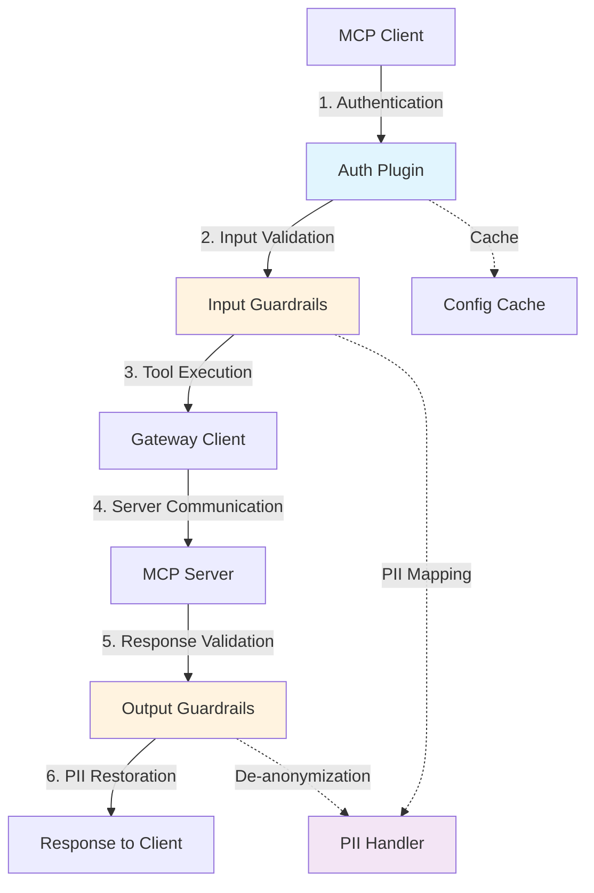

## Introduction

The Secure MCP Gateway implements a comprehensive security architecture designed to protect Model Context Protocol (MCP) communications from a wide range of threats. This page provides an overview of the security model, architecture, and protection mechanisms.

<Info>
**Security-First Design**: The gateway acts as a security layer between MCP clients (like Claude Desktop, Cursor) and MCP servers, enforcing authentication, authorization, and guardrails on all communications.
</Info>

## Threat Model

The Secure MCP Gateway protects against the following threat categories:

### Critical Threats (Rank 1-4)

<AccordionGroup>
  <Accordion title="Prompt Injection" icon="terminal" defaultOpen>
    **Risk Level**: Critical (Rank #1)
    
    Attackers attempt to manipulate AI behavior by injecting malicious instructions through:
    - Tool descriptions containing hidden commands
    - Server metadata with instruction overrides
    - User data embedding system prompts
    - Document content with context hijacking
    
    **Mitigation**: Injection attack detection, policy violation guardrails
  </Accordion>

  <Accordion title="Command Injection" icon="code">
    **Risk Level**: Critical (Rank #2)
    
    Exploitation of OS command execution through:
    - Unsanitized parameters passed to shell commands
    - File paths with embedded shell metacharacters
    - Tool arguments containing command separators
    
    **Mitigation**: Command injection detection, tool registration validation
  </Accordion>

  <Accordion title="Remote Code Execution (RCE)" icon="bug">
    **Risk Level**: Critical (Rank #4)
    
    Direct code execution in application runtime via:
    - Unsafe deserialization (pickle, YAML, JSON)
    - Template injection (Jinja2, Twig)
    - Dynamic code evaluation (eval, exec)
    
    **Mitigation**: Server/tool registration guardrails, keyword detection
  </Accordion>
</AccordionGroup>

### High-Risk Threats (Rank 5-10)

<CardGroup cols={2}>
  <Card title="Credential Theft" icon="key">
    Unauthorized access to:
    - Environment variables with secrets
    - Configuration files with API keys
    - Authentication tokens and sessions
    
    **Mitigation**: PII detection, sensitive data masking
  </Card>

  <Card title="Path Traversal" icon="folder-tree">
    Directory traversal attacks:
    - Reading arbitrary files (../../etc/passwd)
    - Writing to restricted locations
    - Zip slip vulnerabilities
    
    **Mitigation**: Tool validation, keyword blocking
  </Card>

  <Card title="Server-Side Request Forgery" icon="globe">
    Unauthorized network access:
    - Internal network scanning
    - Cloud metadata service access
    - Bypassing network restrictions
    
    **Mitigation**: OpenWorldHint validation, policy checks
  </Card>

  <Card title="Resource Exhaustion" icon="gauge-high">
    Denial of service through:
    - Infinite loops and CPU exhaustion
    - Memory bombs and allocation attacks
    - Disk space consumption
    
    **Mitigation**: Timeout management, sponge attack detection
  </Card>
</CardGroup>

## Security Architecture

### Multi-Layer Defense

The gateway implements defense-in-depth with multiple security layers:



### Security Components

<Steps>
  <Step title="Authentication Layer">
    **API Key Validation**: Every request requires a valid gateway API key
    
    - Key-based authentication with project/user context
    - Secure key generation (256-character random strings)
    - Key rotation and management capabilities
    
    **Implementation**: Plugin-based auth system supports local and remote validation
  </Step>

  <Step title="Server Registration Validation">
    **Tool Discovery Protection**: Validates MCP servers during discovery
    
    - Server metadata scanning for malicious patterns
    - Tool description analysis for injection attempts
    - Destructive/OpenWorld hint enforcement
    
    **Block Mode**: Prevents registration of unsafe servers entirely
  </Step>

  <Step title="Input Guardrails">
    **Pre-Execution Protection**: Validates requests before sending to servers
    
    - Content analysis for threats and policy violations
    - PII detection and automatic redaction
    - Injection attack prevention
    
    **Configurable**: Per-server guardrail policies with custom block lists
  </Step>

  <Step title="Output Guardrails">
    **Post-Execution Protection**: Validates responses before returning to client
    
    - All input checks plus output-specific validations
    - Relevancy and adherence checking
    - Hallucination detection
    - Automatic PII de-anonymization
    
    **Smart Restoration**: PII redacted on input is restored in safe outputs
  </Step>
</Steps>

## Protection Mechanisms

### 1. Guardrail System

The guardrail system provides real-time threat detection and prevention:

<CodeGroup>
```json Server Configuration
{
  "server_name": "github_server",
  "enable_tool_guardrails": true,
  "input_guardrails_policy": {
    "enabled": true,
    "policy_name": "Sample Airline Guardrail",
    "additional_config": {
      "pii_redaction": true
    },
    "block": [
      "policy_violation",
      "injection_attack",
      "toxicity",
      "nsfw",
      "keyword_detector",
      "bias"
    ]
  },
  "output_guardrails_policy": {
    "enabled": true,
    "policy_name": "Sample Airline Guardrail",
    "additional_config": {
      "relevancy": true,
      "adherence": true,
      "hallucination": false
    },
    "block": [
      "policy_violation"
    ]
  }
}
```

```python Detection Flow
# Input Validation
async def validate_input(request, policy):
    # 1. PII Detection & Redaction
    if policy.pii_redaction:
        redacted_text, pii_mapping = await redact_pii(request)
        request = redacted_text
    
    # 2. Threat Detection
    violations = []
    if "injection_attack" in policy.block:
        violations += await detect_injection(request)
    if "toxicity" in policy.block:
        violations += await detect_toxicity(request)
    
    # 3. Block if violations found
    if violations:
        return GuardrailResponse(
            is_safe=False,
            action=GuardrailAction.BLOCK,
            violations=violations
        )
```
</CodeGroup>

### 2. Authentication & Authorization

**API Key Management**:
- Unique keys per user-project combination
- Automatic generation with high entropy
- Secure storage and retrieval
- Rotation capabilities

**Admin API Security**:
- Separate admin API key (256-char random)
- Bearer token authentication for REST API
- CORS configuration for web access

### 3. Sensitive Data Protection

<Tabs>
  <Tab title="Environment Variables">
    **Auto-Masking**: Sensitive environment variables are automatically masked in logs
    
    ```python
    # Masked patterns
    sensitive_keys = [
        "token", "key", "secret", "password",
        "auth", "credential", "apikey", "api_key"
    ]
    
    # Example
    "AWS_SECRET_ACCESS_KEY" → "AWS_****_KEY"
    ```
  </Tab>
  
  <Tab title="HTTP Headers">
    **Header Sanitization**: Authentication headers masked in telemetry
    
    ```python
    # Masked headers
    sensitive_patterns = [
        "authorization", "bearer", "cookie",
        "session", "x-api-key", "x-auth"
    ]
    
    # Example
    "Authorization: Bearer abc123" → "Au***23"
    ```
  </Tab>
  
  <Tab title="Cache Keys">
    **Key Hashing**: All cache keys are MD5 hashed
    
    ```python
    import hashlib
    
    def hash_key(key):
        return hashlib.md5(key.encode()).hexdigest()
    
    # Prevents exposure of sensitive identifiers
    ```
  </Tab>
</Tabs>

### 4. Timeout Management

**Operation Timeouts**: Prevents resource exhaustion attacks

| Operation Type | Default Timeout | Purpose |
|---------------|----------------|----------|
| Guardrail Validation | 15s | Prevent DoS via guardrail API |
| Tool Execution | 60s | Limit long-running tools |
| Discovery | 20s | Bound server discovery time |
| Authentication | 10s | Fast-fail auth checks |
| Cache Operations | 5s | Quick cache access |

**Escalation Policies**:
- Warn at 80% of timeout
- Hard timeout at 100%
- Failure at 120% (grace period)

## Fail-Safe Defaults

<Warning>
**Security Posture**: The gateway implements fail-closed defaults for security-critical operations
</Warning>

### Fail-Closed Scenarios

1. **Guardrail API Errors**: If guardrail validation fails due to API errors or timeouts, **block the request**
2. **Tool Registration Errors**: If tool validation encounters errors, **prevent tool registration**
3. **Authentication Failures**: If auth validation fails, **reject the request**
4. **Unauthorized Access**: If API key validation fails with auth errors, **block access**

### Fail-Open Scenarios

1. **Discovery Errors** (non-guardrail): Allow server discovery if not using tool guardrails
2. **Cache Failures**: Fall back to direct queries if cache is unavailable
3. **Telemetry Errors**: Continue operation if logging/tracing fails

## Security Best Practices

<AccordionGroup>
  <Accordion title="For Gateway Administrators" icon="user-shield">
    1. **Use Strong API Keys**: Generate keys with high entropy (use built-in generator)
    2. **Enable Guardrails**: Always enable guardrails for external/untrusted MCP servers
    3. **Configure Block Lists**: Customize block lists based on your threat model
    4. **Monitor Metrics**: Track guardrail blocks and violations in Grafana
    5. **Rotate Keys Regularly**: Use `secure-mcp-gateway apikey rotate` periodically
    6. **Review Logs**: Check structured logs for security events
    7. **Use External Cache**: Deploy Redis/KeyDB for multi-instance setups
    8. **Backup Configs**: Regular backups with `secure-mcp-gateway system backup`
  </Accordion>

  <Accordion title="For MCP Server Developers" icon="code">
    1. **Clear Tool Descriptions**: Write accurate descriptions without promotional language
    2. **Set Proper Annotations**:
       - `destructiveHint: true` for any tool that modifies state
       - `readOnlyHint: true` only for truly read-only operations
       - `openWorldHint: true` if tool accesses external networks
    3. **Validate Inputs**: Always validate and sanitize tool parameters
    4. **Avoid Dangerous Patterns**: Don't use eval, exec, pickle, or shell commands
    5. **Least Privilege**: Request minimum necessary permissions
    6. **Document Security**: Clearly document any security considerations
  </Accordion>

  <Accordion title="For End Users" icon="user">
    1. **Trust But Verify**: Review MCP servers before adding to gateway
    2. **Check Tool Descriptions**: Look for suspicious or vague descriptions
    3. **Review Permissions**: Understand what destructive/openWorld tools do
    4. **Report Issues**: Report suspicious servers to gateway administrators
    5. **Use Separate Projects**: Isolate high-risk servers in dedicated projects
  </Accordion>
</AccordionGroup>

## Security Metrics & Monitoring

### Key Metrics

**Guardrail Performance**:
- `guardrail_blocks_total` - Total requests blocked by guardrails
- `guardrail_violations_by_type` - Violations by type (injection, PII, etc.)
- `guardrail_latency_ms` - Guardrail evaluation time
- `pii_redactions_total` - PII redaction operations

**Authentication Metrics**:
- `auth_failures_total` - Failed authentication attempts
- `auth_latency_ms` - Authentication check duration
- `active_api_keys` - Number of active keys

**Tool Security Metrics**:
- `tool_registrations_blocked` - Tools blocked during discovery
- `server_registrations_blocked` - Servers blocked during validation
- `destructive_tools_executed` - Destructive tool invocations

### Grafana Dashboards

The gateway includes pre-built Grafana dashboards for security monitoring:

- **Security Overview**: High-level security posture
- **Guardrail Performance**: Detailed guardrail metrics
- **Threat Detection**: Real-time threat indicators
- **Audit Trail**: Complete request/response audit log

## Next Steps

<CardGroup cols={2}>
  <Card title="Guardrail Types" icon="filter" href="/security/guardrail-types">
    Explore all guardrail types and detection mechanisms
  </Card>
  
  <Card title="PII Handling" icon="user-lock" href="/security/pii-handling">
    Learn about PII detection, redaction, and de-anonymization
  </Card>
  
  <Card title="Security Testing" icon="flask" href="/security/testing">
    Test your security posture with bad_mcps attack scenarios
  </Card>
  
  <Card title="Configuration" icon="gear" href="/guides/configuring-guardrails">
    Configure guardrails for your MCP servers
  </Card>
</CardGroup>

## Resources

<CardGroup cols={3}>
  <Card title="MCP Security Top 25" icon="external-link" href="https://adversa.ai/mcp-security-top-25-mcp-vulnerabilities/">
    Adversa.ai vulnerability ranking
  </Card>
  
  <Card title="JFrog RCE Research" icon="external-link" href="https://research.jfrog.com/vulnerabilities/mcp-remote-command-injection-rce-jfsa-2025-001290844/">
    MCP command injection vulnerability
  </Card>
  
  <Card title="Enkrypt Blog" icon="external-link" href="https://www.enkryptai.com/blog/how-enkrypts-secure-mcp-gateway-and-mcp-scanner-prevent-top-attacks">
    How the Gateway prevents top attacks
  </Card>
</CardGroup>