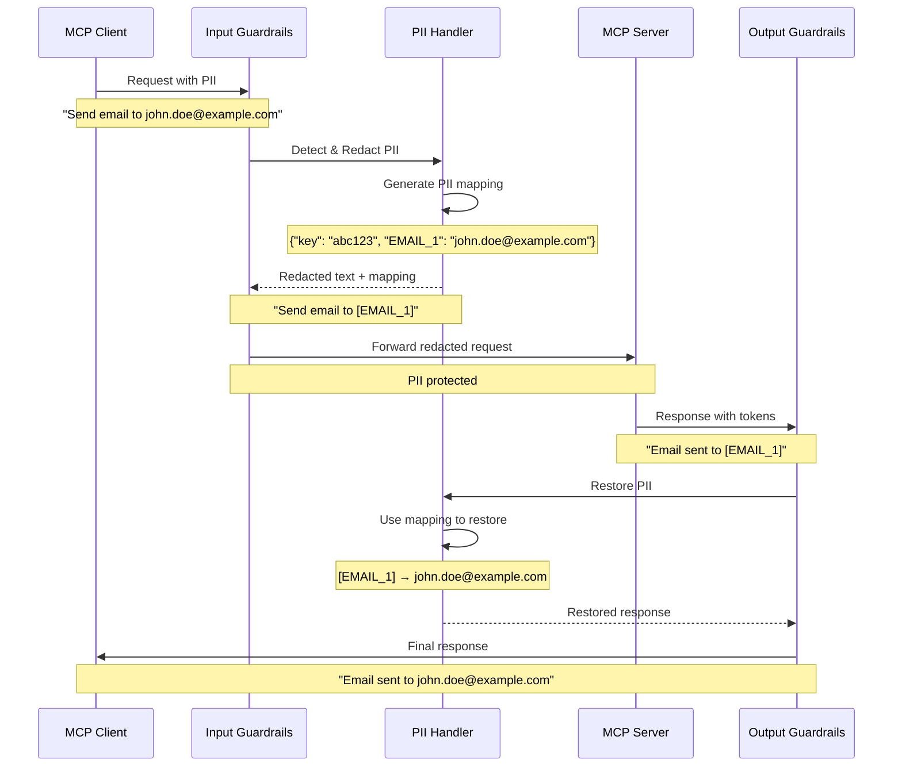

## Overview

The Secure MCP Gateway provides automatic detection and redaction of Personally Identifiable Information (PII) to protect sensitive user data. The PII handling system operates transparently:

1. **Input**: PII is detected and redacted before sending to MCP servers
2. **Processing**: MCP servers see only redacted/anonymized data
3. **Output**: PII is automatically restored in responses (de-anonymization)

<Info>
**Zero Trust for PII**: Even trusted MCP servers never see original PII values, reducing data exposure risk.
</Info>

## How PII Redaction Works

### Complete Flow



### Step-by-Step Process

<Steps>
  <Step title="PII Detection">
    **Input Analysis**: Scan request for PII entities
    
    The PII handler analyzes the input text using pattern matching and NLP models:
    
    ```python
    async def detect_pii(content: str) -> List[GuardrailViolation]:
        # Call Enkrypt PII API with mode="request"
        payload = {
            "text": content,
            "mode": "request",
            "key": "null"  # No existing mapping
        }
        
        result = await call_pii_api(payload)
        
        # If text changed, PII was detected
        if result["text"] != content:
            return [PII_VIOLATION]
        return []
    ```
    
    **Example**:
    ```
    Input: "Contact John Smith at john.smith@example.com or 555-123-4567"
    
    Detected:
    - NAME: "John Smith"
    - EMAIL: "john.smith@example.com"  
    - PHONE: "555-123-4567"
    ```
  </Step>

  <Step title="PII Redaction">
    **Token Replacement**: Replace PII with anonymized tokens
    
    Each PII entity is replaced with a unique token:
    
    ```python
    async def redact_pii(content: str) -> tuple[str, Dict[str, Any]]:
        payload = {
            "text": content,
            "mode": "request",
            "key": "null"
        }
        
        result = await call_pii_api(payload)
        
        redacted_text = result["text"]
        pii_key = result["key"]  # Unique key for this session
        
        return redacted_text, {"key": pii_key}
    ```
    
    **Example**:
    ```
    Original: "Contact John Smith at john.smith@example.com or 555-123-4567"
    
    Redacted: "Contact [NAME_1] at [EMAIL_1] or [PHONE_1]"
    
    Mapping (stored with key "abc123xyz"):
    {
      "NAME_1": "John Smith",
      "EMAIL_1": "john.smith@example.com",
      "PHONE_1": "555-123-4567"
    }
    ```
  </Step>

  <Step title="Protected Processing">
    **Server Communication**: Send redacted text to MCP server
    
    The MCP server receives only anonymized data:
    
    ```
    MCP Server receives: "Contact [NAME_1] at [EMAIL_1] or [PHONE_1]"
    
    Server processes request without seeing actual PII
    
    MCP Server responds: "Contact request sent to [EMAIL_1]. [NAME_1] will be notified at [PHONE_1]."
    ```
  </Step>

  <Step title="PII Restoration (De-anonymization)">
    **Token Replacement (Reverse)**: Restore original PII in response
    
    Using the stored mapping, tokens are replaced with original values:
    
    ```python
    async def restore_pii(content: str, pii_mapping: Dict[str, Any]) -> str:
        pii_key = pii_mapping.get("key", "")
        if not pii_key:
            return content  # No PII to restore
        
        payload = {
            "text": content,
            "mode": "response",
            "key": pii_key  # Use same key from redaction
        }
        
        result = await call_pii_api(payload)
        return result["text"]
    ```
    
    **Example**:
    ```
    Server Response: "Contact request sent to [EMAIL_1]. [NAME_1] will be notified at [PHONE_1]."
    
    Restored: "Contact request sent to john.smith@example.com. John Smith will be notified at 555-123-4567."
    ```
  </Step>
</Steps>

## Supported PII Types

<AccordionGroup>
  <Accordion title="Personal Information" icon="id-card" defaultOpen>
    **Names**:
    - Person names (first, last, full)
    - Organization names
    - Nicknames and aliases
    
    **Identifiers**:
    - Social Security Numbers (SSN)
    - Tax IDs (EIN, ITIN)
    - National ID numbers
    - Passport numbers
    - Driver's license numbers
    
    **Example**:
    ```
    Input: "John Q. Public, SSN 123-45-6789"
    Redacted: "[NAME_1], SSN [SSN_1]"
    ```
  </Accordion>

  <Accordion title="Contact Information" icon="address-book">
    **Email Addresses**:
    - Standard emails (user@domain.com)
    - Subdomains (user@mail.domain.com)
    - Plus addressing (user+tag@domain.com)
    
    **Phone Numbers**:
    - US format: (555) 123-4567
    - International: +1-555-123-4567
    - Extensions: 555-1234 x567
    
    **Physical Addresses**:
    - Street addresses
    - Cities, states, ZIP codes
    - Country information
    - PO boxes
    
    **Example**:
    ```
    Input: "Email: support@company.com, Phone: +1-555-0100, Address: 123 Main St, New York, NY 10001"
    Redacted: "Email: [EMAIL_1], Phone: [PHONE_1], Address: [ADDRESS_1]"
    ```
  </Accordion>

  <Accordion title="Financial Information" icon="credit-card">
    **Payment Cards**:
    - Credit card numbers (Visa, MasterCard, Amex, Discover)
    - Debit card numbers
    - CVV codes
    - Expiration dates
    
    **Bank Details**:
    - Account numbers
    - Routing numbers
    - IBAN codes
    - SWIFT codes
    
    **Example**:
    ```
    Input: "Card: 4532-1234-5678-9010, CVV: 123, Exp: 12/25"
    Redacted: "Card: [CARD_1], CVV: [CVV_1], Exp: [DATE_1]"
    ```
  </Accordion>

  <Accordion title="Network & System Information" icon="network-wired">
    **IP Addresses**:
    - IPv4 (192.168.1.1)
    - IPv6 (2001:0db8:85a3::8a2e:0370:7334)
    - Private IPs (10.0.0.0/8, 172.16.0.0/12, 192.168.0.0/16)
    
    **MAC Addresses**:
    - Standard format (00:1B:44:11:3A:B7)
    - Cisco format (001B.4411.3AB7)
    - Windows format (00-1B-44-11-3A-B7)
    
    **Example**:
    ```
    Input: "Server IP: 192.168.1.100, MAC: 00:1B:44:11:3A:B7"
    Redacted: "Server IP: [IP_1], MAC: [MAC_1]"
    ```
  </Accordion>

  <Accordion title="Temporal Information" icon="calendar">
    **Dates**:
    - Birth dates
    - Event dates
    - Timestamps
    
    **Ages**:
    - Exact ages
    - Age ranges (if specific)
    
    **Example**:
    ```
    Input: "DOB: 01/15/1990, Age: 35"
    Redacted: "DOB: [DATE_1], Age: [AGE_1]"
    ```
  </Accordion>
</AccordionGroup>

## Configuration

### Enable PII Redaction

**Per-Server Configuration**:

```json
{
  "server_name": "customer_service_server",
  "input_guardrails_policy": {
    "enabled": true,
    "additional_config": {
      "pii_redaction": true  // Enable automatic redaction
    },
    "block": []  // Don't block on PII, just redact
  },
  "output_guardrails_policy": {
    "enabled": true,
    "additional_config": {
      "pii_redaction": false  // De-anonymization happens automatically
    }
  }
}
```

### Block on PII Detection (Optional)

You can also **block** requests that contain PII instead of redacting:

```json
{
  "input_guardrails_policy": {
    "enabled": true,
    "additional_config": {
      "pii_redaction": false  // Don't redact, just detect
    },
    "block": ["pii"]  // Block if PII is detected
  }
}
```

**Use Case**: Prevent users from accidentally including PII in public-facing tools.

### Custom PII Entities

Configure which PII types to detect:

```json
{
  "input_guardrails_policy": {
    "enabled": true,
    "additional_config": {
      "pii_redaction": true,
      "pii_entities": [
        "EMAIL",
        "PHONE",
        "SSN",
        "CREDIT_CARD"
      ]
    }
  }
}
```

## PII Mapping Security

### Secure Storage

<Warning>
**Ephemeral Mappings**: PII mappings are stored only for the duration of the request/response cycle
</Warning>

The PII mapping is:
1. Generated server-side by Enkrypt API
2. Associated with a unique session key
3. Never logged or persisted
4. Automatically expires after use
5. Encrypted in transit (HTTPS)

### Mapping Key Structure

```python
# PII Mapping Example
{
  "key": "a1b2c3d4e5f6g7h8i9j0",  # Unique session key
  "mappings": {
    "NAME_1": "<encrypted_value>",
    "EMAIL_1": "<encrypted_value>",
    "PHONE_1": "<encrypted_value>"
  }
}
```

**Security Properties**:
- Keys are cryptographically random (160+ bits of entropy)
- Mappings are never exposed in logs
- Keys cannot be reused across sessions
- Server-side storage is encrypted at rest

## Advanced Use Cases

### Scenario 1: Customer Support

**Goal**: Protect customer PII when using AI tools

```json
{
  "server_name": "customer_support_ai",
  "description": "AI assistant for customer support",
  "input_guardrails_policy": {
    "enabled": true,
    "additional_config": {
      "pii_redaction": true
    }
  }
}
```

**Flow**:
```
Agent: "Customer John Doe called about order #12345, email john@example.com"
  → AI sees: "Customer [NAME_1] called about order #12345, email [EMAIL_1]"
  → AI responds: "I've looked up [EMAIL_1]'s order #12345..."
  → Agent sees: "I've looked up john@example.com's order #12345..."
```

### Scenario 2: Data Analysis

**Goal**: Analyze customer data without exposing PII

```json
{
  "server_name": "analytics_server",
  "input_guardrails_policy": {
    "enabled": true,
    "additional_config": {
      "pii_redaction": true
    }
  }
}
```

**Flow**:
```
Analyst: "Analyze feedback from alice@example.com, bob@example.com"
  → Analytics sees: "Analyze feedback from [EMAIL_1], [EMAIL_2]"
  → Analytics returns: "[EMAIL_1] satisfaction: 85%, [EMAIL_2] satisfaction: 92%"
  → Analyst sees: "alice@example.com satisfaction: 85%, bob@example.com satisfaction: 92%"
```

### Scenario 3: Compliance (GDPR/CCPA)

**Goal**: Minimize PII exposure for compliance

```json
{
  "server_name": "gdpr_compliant_server",
  "input_guardrails_policy": {
    "enabled": true,
    "policy_name": "GDPR Compliance Policy",
    "additional_config": {
      "pii_redaction": true,
      "pii_entities": ["EMAIL", "PHONE", "SSN", "NAME", "ADDRESS"]
    },
    "block": ["pii"]  // Optional: block instead of redact for strict compliance
  }
}
```

## Limitations & Best Practices

<AccordionGroup>
  <Accordion title="Detection Accuracy" icon="bullseye">
    **Not 100% Accurate**: PII detection uses ML models with ~95-98% accuracy
    
    **False Positives**:
    - Generic names ("John Smith" in documentation)
    - Example emails (user@example.com)
    - Sample phone numbers (555-0100)
    
    **False Negatives**:
    - Obfuscated PII (j.doe@example.com as "j dot doe at example")
    - Non-standard formats
    - Context-dependent PII
    
    **Best Practice**:
    - Test with sample data before production
    - Review redaction results periodically
    - Use additional guardrails (keyword detection) for critical PII
  </Accordion>

  <Accordion title="Performance Impact" icon="gauge">
    **Latency**: PII redaction adds 50-150ms per request
    
    **Optimization**:
    - Enable only for servers handling user data
    - Use selective entity types (don't detect all PII if unnecessary)
    - Cache redaction results for repeated inputs
    
    **Monitoring**:
    ```bash
    # Check PII redaction metrics
    secure-mcp-gateway metrics --filter pii
    
    # Output
    pii_redactions_total: 1234
    pii_redaction_latency_avg: 87ms
    pii_restoration_latency_avg: 45ms
    ```
  </Accordion>

  <Accordion title="Context Preservation" icon="puzzle-piece">
    **Challenge**: Redaction may break context for AI understanding
    
    **Example**:
    ```
    Original: "Send meeting invite to john@company.com and jane@company.com"
    Redacted: "Send meeting invite to [EMAIL_1] and [EMAIL_2]"
    
    AI loses context that both emails are from same company
    ```
    
    **Mitigation**:
    - Use partial redaction for non-sensitive patterns
    - Provide domain whitelist (e.g., allow @company.com)
    - Include metadata hints (e.g., "[EMAIL_1 from company.com]")
  </Accordion>

  <Accordion title="Token Persistence" icon="clock">
    **Problem**: Tokens don't persist across sessions
    
    **Example**:
    ```
    Session 1:
      Input: "Email john@example.com"
      Redacted: "Email [EMAIL_1]"
      
    Session 2:
      Input: "Email john@example.com"  
      Redacted: "Email [EMAIL_2]"  // Different token!
    ```
    
    **Why**: Each session gets a unique PII key for security
    
    **Best Practice**: If consistency needed, use custom identifiers instead of PII
  </Accordion>
</AccordionGroup>

## Testing PII Redaction

### Manual Testing

```bash
# Test with sample PII
echo '{"text": "Contact John Doe at john.doe@example.com or 555-123-4567"}' | \
  curl -X POST https://api.enkryptai.com/guardrails/pii \
    -H "apikey: YOUR_API_KEY" \
    -H "Content-Type: application/json" \
    -d @-

# Response
{
  "text": "Contact [NAME_1] at [EMAIL_1] or [PHONE_1]",
  "key": "abc123xyz789"
}
```

### Integration Testing

```python
# Test PII redaction in gateway
import asyncio
from secure_mcp_gateway.plugins.guardrails.enkrypt_provider import EnkryptPIIHandler

async def test_pii():
    handler = EnkryptPIIHandler(
        api_key="YOUR_API_KEY",
        base_url="https://api.enkryptai.com"
    )
    
    # Test redaction
    text = "Email me at john.doe@example.com"
    redacted, mapping = await handler.redact_pii(text)
    
    print(f"Original: {text}")
    print(f"Redacted: {redacted}")
    print(f"Mapping Key: {mapping['key']}")
    
    # Test restoration
    response = "Message sent to [EMAIL_1]"
    restored = await handler.restore_pii(response, mapping)
    
    print(f"Response: {response}")
    print(f"Restored: {restored}")

asyncio.run(test_pii())
```

### Automated Testing

Use the included test suite:

```bash
# Run PII tests
pytest tests/test_pii_handling.py -v

# Test with sample data
pytest tests/test_pii_handling.py::test_redact_email
pytest tests/test_pii_handling.py::test_redact_phone
pytest tests/test_pii_handling.py::test_restore_pii
```

## Monitoring & Metrics

### PII Metrics

**Available Metrics**:
- `pii_redactions_total` - Total PII redaction operations
- `pii_detections_by_type` - PII detections by entity type (EMAIL, PHONE, etc.)
- `pii_redaction_latency` - Time to redact PII
- `pii_restoration_latency` - Time to restore PII
- `pii_failures_total` - Failed PII operations

**Grafana Dashboard**:

The gateway includes a PII monitoring dashboard showing:
- Redaction rate over time
- PII types detected
- Latency percentiles (p50, p95, p99)
- Error rates

### Logging

**PII events are logged** (with PII values masked):

```json
{
  "event": "pii_redacted",
  "timestamp": "2025-01-15T10:30:00Z",
  "server_name": "customer_support",
  "entities_detected": ["EMAIL", "PHONE"],
  "entity_count": 2,
  "original_length": 150,
  "redacted_length": 135,
  "pii_key": "****xyz",  // Last 3 chars only
  "latency_ms": 87
}
```

## Next Steps

<CardGroup cols={2}>
  <Card title="Security Testing" icon="flask" href="/security/testing">
    Test PII redaction with attack scenarios
  </Card>
  
  <Card title="Guardrail Types" icon="shield-halved" href="/security/guardrail-types">
    Learn about other guardrail types
  </Card>
  
  <Card title="Configuration" icon="gear" href="/guides/configuring-guardrails">
    Configure PII redaction for your servers
  </Card>
  
  <Card title="Compliance" icon="scale-balanced" href="/security/overview">
    GDPR/CCPA compliance guide
  </Card>
</CardGroup>